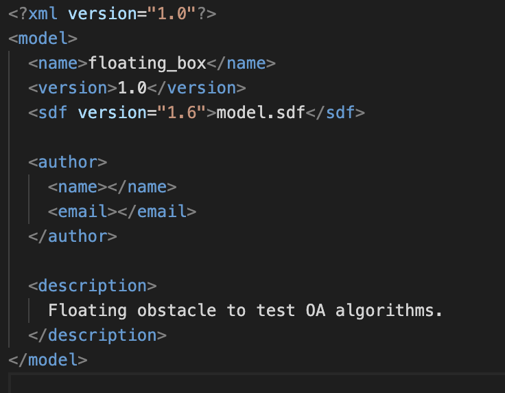
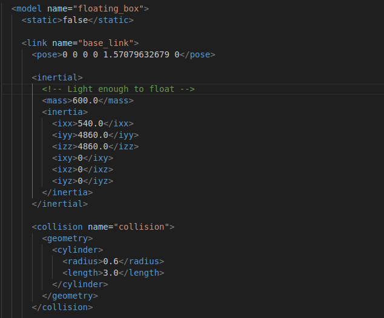
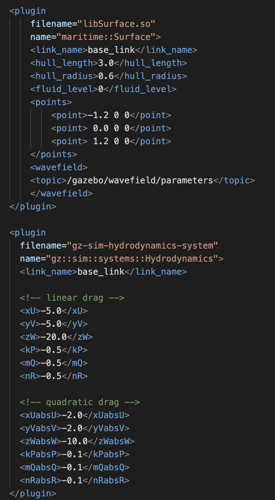

## Boat Simulation for Obstacle Avoidance

This project is an attempt to make the task of setting up an ASV (autonomous surface vessel) simulation a bit easier in order to help people who might be curious to try some sensor or some algorithm in a simulation environment without requiring them to put in the time to set up a simulation from scratch. 

### Using the existing code

This code uses Gazebo Harmonic as well as Ardupilot. First, clone this repository with the `--recurse-submodules` flag, as the Ardupilot repository is contained as a submodule. 

Afterwards, follow the instructions for setting up [Gazebo Harmonic](https://gazebosim.org/docs/harmonic/getstarted/) and [Ardupilot SITL](https://ardupilot.org/dev/docs/setting-up-sitl-on-linux.html). Afterwards, ensure that the `src/` directory of the repository is part of the Gazebo resource path, plugin path, and library path. This can be set in the `gazebo_maritime_ws/tutorial.env` environment file --- change the paths in the file to ones that match your computer, and source this environment before running the simulation with `source gazebo_maritime_ws/tutorial.env`. Using the rest of the code is typically easiest from the `gazebo_maritime_ws/` directory.

#### Running the individual parts of the code

To run the Gazebo simulator, from the gazebo_maritime_ws directory:

```
gz sim -v 4 src/gazebo_maritime/worlds/sydney_regatta.sdf
```

Spawn obstacles:
```
python obs.py test_obs.yaml fixed_obs.yaml 
```

Activate the right environment varibles
```
source tutorial.env
```

Run the Ardupilot simulator without any additional ports:
```
sim_vehicle.py -v Rover -f gazebo-rover --model JSON
```

In the Ardupilot simulator, we need to add a few outputs or links in order for the simulator to communicate with other things we need.
```
sim_vehicle.py -v Rover --model JSON --mavproxy-args="--out=127.0.0.1:14552 --out=127.0.0.1:14553 --master=udp:127.0.0.1:14560"
```

mention these are heartbeat to the vision script, output to log obstacle distances, and link to communicate obstacle distances, 

Start streaming the depth image and image (requires the Gazebo simulator to be running)
```
gz topic -t /depth_camera/depth_image/enable_streaming -m gz.msgs.Boolean -p "data: 1"
gz topic -t /depth_camera/image/enable_streaming -m gz.msgs.Boolean -p "data: 1"
```

Stream the camera image (requires the image to have streaming enabled)
```
gst-launch-1.0 -v udpsrc port=5600 caps='application/x-rtp, media=(string)video, clock-rate=(int)90000, encoding-name=(string)H264' ! rtph264depay ! avdec_h264 ! videoconvert ! autovideosink sync=false
```

Process the depth via Python (requires the depth image to have streaming enabled)
```
python process_sim_depth.py
```

#### Setting up a mission

In QGC, with the sim_vehicle simulation running, the vehicle should appear as a connection in QGC, typically showing 'Not Ready' in the corner. By default, the GPS position of the world file is somewhere in Australia, though this can be moved.

Click on the upper left Q icon, and select the 'Analyze Tools' menu. In this menu, the MAVLink inspector allows us to see MAVLink messages coming into the vehicle, as well as their frequencies. In our case, we want to ensure the OBSTACLE_DISTANCES are being logged. For other projects, where other MAVLink messages may be desired, something else may be desirable here.

We need to upload waypoints for the boat to move to. This can be done directly in QGC using the 'Plan Flight' option, accessed via the button in the upper left corner. However, it may be desirable for us to automate this process somewhat via a script. To do this, the `upload_waypoints.py` script takes in a list of (lat, lon, alt) points (where altitude doens't matter for our use case) and uploads them to the simulated robot. Upon running this script, the boat will immediately enter AUTO state and begin following the mission.

When the waypoints are uploaded from outside of QGC, they may not immediately appear, and it can be hard to figure out where the boat is actually navigating to. To refresh the waypoints visually, click on the upper left menu and enter 'Plan Flight' mode. Once there, the 'File' menu on the left opens up an interface that allows for waypoints to be uploaded or downloaded. In this case, we want to download the waypoints --- this transfers them from the robot (our SITL simulation) to the software (QGC). If we wanted to plan waypoints in QGC and send them to the robot, we would select upload instead. 


### Changing this to work with other code

The paths in the environment file are currently set up to look at an `install/` directory, which is populated by building the `src/` directory. While not necessary for the XML-adjacent files that make up the models and worlds, this is a clearer pattern that becomes necessary when writing plugins, which would need to be compiled into executable code. This, because we've set up the repository this way, **remember to** `colcon build --merge-install` **from the** `gazebo_maritime_ws` **directory after making any changes to a model file**. Otherwise, you may think your changes ineffective, when in reality they haven't been copied over to the `install/` directory.

#### Editing model and world files

The model and world files used in this tutorial are SDF ('Simulation Description Format') files, a file format used by Gazebo to describe the layout of an object or scene in a simulation. These have a hierarchical structure and are formatted like an XML file. For documentation on what elements are defined in an SDF, the [SDFormat website](https://sdformat.org/) provides class references with examples of the different elements that can be defined within an SDF file. This is particularly useful when using elements like `<sensor>`, which have different options depending on the choice of higher-level sensor.

For working with these files, I would recommend reading the provided SDF files in the tutorial, defining both the `sydney_regatta` world and the `wam-v` boat. These have been put together well, and were the primary way in which I learned about structuring the simpler SDF files and adding or removing elements to the provided ones. There are also plenty of examples online for model files in Gazebo.



Note that when making a new model in Gazebo, it requires not just an SDF file, but a directory in the `gazebo_maritime_ws/src/gazebo_maritime/models` directory, with the name of the directory the same as the model name. Inside this directory, the model SDF file should be named `model.sdf`, and a separate `model.config` file must exist for the model to be recognized. At minimum, this config file provides the name of the model, an XML version, and an SDF version. This can also include a description and the attribution of the file's author. 



In order to change any of these files in place, some of the parameters that can be edited are fairly apparent. For instance, this is part of the SDF file for the floating cylinder. The higher level element is the `<model>`, which describes the name of the model file. Each model can cotain a number of links, which specify specific frames local to the object and are used for positioning different elements of the object. This contains only a single base_link, which has attached to it both an inertial element (describes the mass and intertia matrix for the object, allowing physics to apply to it) and a collision element (which allows the object to collide with other objects, and defines the shape of its collision.) Later in the file, a visual element also ensures the object can be rendered. 

In the context of this simulation, models need to include two plugins in order to ensure the water affects them properly. This first of these is `libSurface`, a wrapper for buoyancy with water at a fixed height which allows for a wavefield topic to be provided in order for cylindrical objects to respond to waves. The second of these plugins is Hydrodynamics, which specifies how different hydrodynamic forces act on the object to damp its motion through the water.



The libSurface plugin should be applied to each link with intertia. The plugin requires you provide a link to apply the buoyant forces to, provided with a length and radius of the link. This plugin assumes we're using cylindrical floats on a boat, and so specifically expects a cylindrical body, though something with dimensions close to this should still work. The plugin also requires knowledge of the vertical level fluid exists below (in our simulation, the surface is at height `0`) as well as a topic to listen to for wavefield parameters, which describe how sinusoidal waves are applied to the simulation. The `points` element describes all the points in the link in which these buoyant forces should be applied --- by providing forces at the ends of the cylinder, we allow for forces at different points to turn the object.

The Hydrodynamics plugin also takes the name of a link to apply forces to and otherwise consists entirely of a number of physical parameters describing how hydrodynamic forces would act on the object. These correspond to the linear and quadratic drag coefficients in each of the 6 degrees of freedom of the object, and are explained [here](https://gazebosim.org/api/sim/9/theory_hydrodynamics.html).

#### Interoperability between Gazebo, Ardupilot, and Python

in progress

#### Troubleshooting

A few issues that I ran into, or steps to take when certain parts of the project aren't working:

- If changes to the SDF file don't seem to be having a strong effect on the simulation, **remember to rebuild** --- run ```colcon build --merge-install` from the parent directory of the `src/` folder. If this still doesn't work, check to make sure the SDF files in the `install/` directory reflect changes, and check the path to ensure Gazebo is finding these files.

- If `gz sim` is not recognized as a valid option (and a smaller subset of `gz` commands are) this indicates that an incomplete install of Gazebo is located first on the PATH. This may be due to how the Python bindings for gz-transport are installed --- when I first installed these, I used a different Gazebo version by mistake, and it was found first on the PATH. Make sure the proper Gazebo executable is called (`which gz`) and update the path if necessary to point to the proper Gazebo Harmonic install. Also, make sure you've sourced the `.env` file if in a new terminal session.

- If the simulation won't resume and returns a `duplicate input frame` error, this is caused by the SITL simulation from Ardupilot running and interfering with the Gazebo simulation before it starts. I'm not sure yet why this happens, but it can be fixed by stopping the SITL simulation, restarting the Gazebo simulation, and unpausing the Gazebo simulation for at least a moment before launching the SITL simulation via `sim_vehicle.py`. 