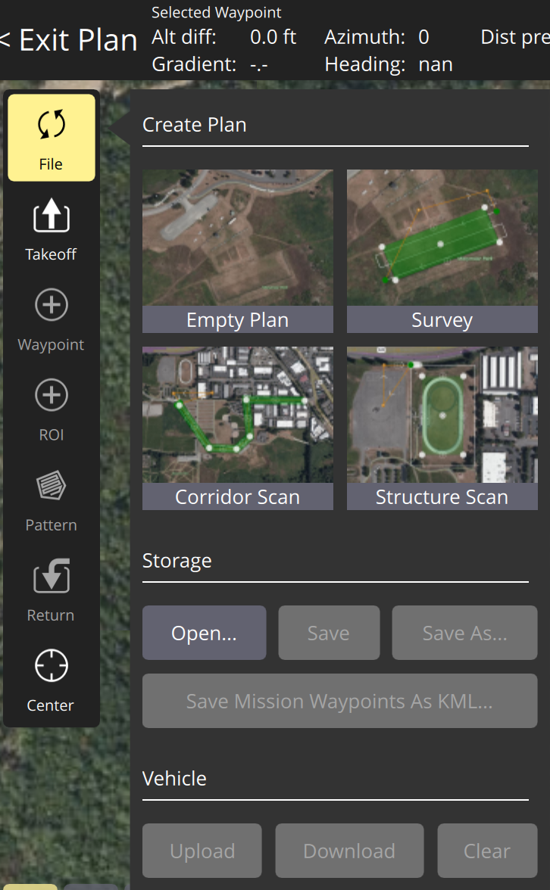

## Boat Simulation for Obstacle Avoidance

This project is an attempt to make the task of setting up an ASV (autonomous surface vessel) simulation a bit easier in order to help people who might be curious to try some sensor or some algorithm in a simulation environment without requiring them to put in the time to set up a simulation from scratch. 

### Using the existing code

This code uses Gazebo Harmonic as well as Ardupilot. First, clone this repository with the `--recurse-submodules` flag, as the Ardupilot repository is contained as a submodule. 

Afterwards, follow the instructions for setting up [Gazebo Harmonic](https://gazebosim.org/docs/harmonic/getstarted/) and [Ardupilot SITL](https://ardupilot.org/dev/docs/setting-up-sitl-on-linux.html). Afterwards, ensure that the `src/` directory of the repository is part of the Gazebo resource path, plugin path, and library path. This can be set in the `gazebo_maritime_ws/tutorial.env` environment file --- change the paths in the file to ones that match your computer, and source this environment before running the simulation with `source gazebo_maritime_ws/tutorial.env`. Using the rest of the code is typically easiest from the `gazebo_maritime_ws/` directory.

#### Running the individual parts of the code

To run the Gazebo simulator, from the gazebo_maritime_ws directory:

```
gz sim -v 4 src/gazebo_maritime/worlds/sydney_regatta.sdf
```

Spawn obstacles:
```
python obs.py test_obs.yaml fixed_obs.yaml 
```

Activate the right environment varibles
```
source tutorial.env
```

Run the Ardupilot simulator without any additional ports:
```
sim_vehicle.py -v Rover -f gazebo-rover --model JSON
```

In the Ardupilot simulator, we need to add a few outputs or links in order for the simulator to communicate with other things we need.
```
sim_vehicle.py -v Rover --model JSON --mavproxy-args="--out=127.0.0.1:14552 --out=127.0.0.1:14553 --master=udp:127.0.0.1:14560"
```

mention these are heartbeat to the vision script, output to log obstacle distances, and link to communicate obstacle distances, 

Start streaming the depth image and image (requires the Gazebo simulator to be running)
```
gz topic -t /depth_camera/depth_image/enable_streaming -m gz.msgs.Boolean -p "data: 1"
gz topic -t /depth_camera/image/enable_streaming -m gz.msgs.Boolean -p "data: 1"
```

Stream the camera image (requires the image to have streaming enabled)
```
gst-launch-1.0 -v udpsrc port=5600 caps='application/x-rtp, media=(string)video, clock-rate=(int)90000, encoding-name=(string)H264' ! rtph264depay ! avdec_h264 ! videoconvert ! autovideosink sync=false
```

Process the depth via Python (requires the depth image to have streaming enabled)
```
python process_sim_depth.py
```

#### Setting up a mission

In QGC, with the sim_vehicle simulation running, the vehicle should appear as a connection in QGC, typically showing 'Not Ready' in the corner. By default, the GPS position of the world file is somewhere in Australia, though this can be moved.

Click on the upper left Q icon, and select the 'Analyze Tools' menu. In this menu, the MAVLink inspector allows us to see MAVLink messages coming into the vehicle, as well as their frequencies. In our case, we want to ensure the OBSTACLE_DISTANCES are being logged. For other projects, where other MAVLink messages may be desired, something else may be desirable here.

We need to upload waypoints for the boat to move to. This can be done directly in QGC using the 'Plan Flight' option, accessed via the button in the upper left corner. However, it may be desirable for us to automate this process somewhat via a script. To do this, the `upload_waypoints.py` script takes in a list of (lat, lon, alt) points (where altitude doens't matter for our use case) and uploads them to the simulated robot. Upon running this script, the boat will immediately enter AUTO state and begin following the mission.

When the waypoints are uploaded from outside of QGC, they may not immediately appear, and it can be hard to figure out where the boat is actually navigating to. To refresh the waypoints visually, click on the upper left menu and enter 'Plan Flight' mode. Once there, the 'File' menu on the left opens up an interface that allows for waypoints to be uploaded or downloaded. In this case, we want to download the waypoints --- this transfers them from the robot (our SITL simulation) to the software (QGC). If we wanted to plan waypoints in QGC and send them to the robot, we would select upload instead. 



### Changing this to work with other code

The paths in the environment file are currently set up to look at an `install/` directory, which is populated by building the `src/` directory. While not necessary for the XML-adjacent files that make up the models and worlds, this is a clearer pattern that becomes necessary when writing plugins, which would need to be compiled into executable code. This, because we've set up the repository this way, **remember to** `colcon build --merge-install` **from the** `gazebo_maritime_ws` **directory after making any changes to a model file**. Otherwise, you may think your changes ineffective, when in reality they haven't been copied over to the `install/` directory.

